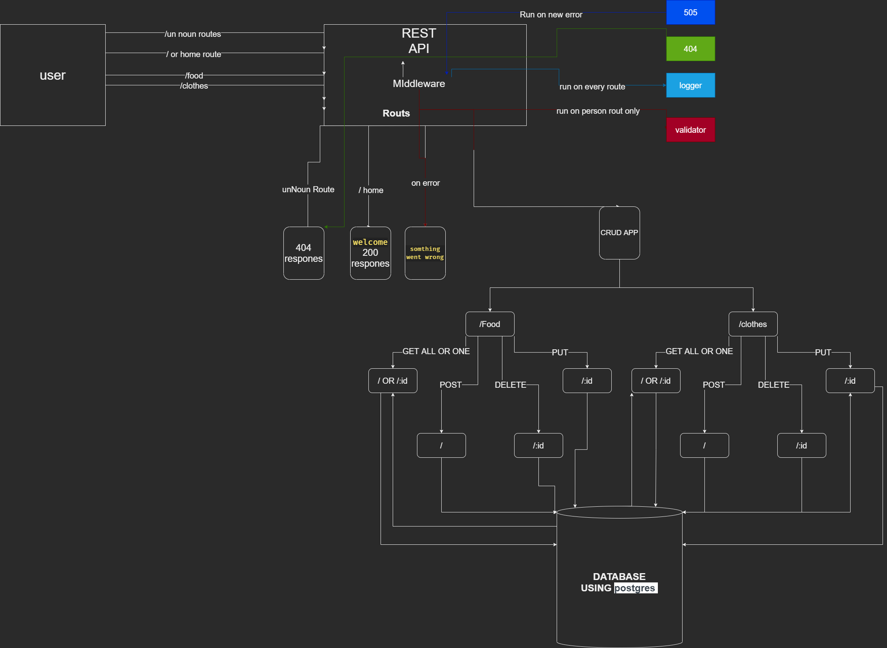

# basic-api-server

## Links

- heroku: [jallad-basic-express-server](https://jallad-basic-api-server.herokuapp.com/)
- github repo: [basic-express-server](https://github.com/Ahmadjlallad/basic-api-server)
- latest PR: [PR](https://github.com/Ahmadjlallad/basic-api-server/pull/1)
- Github actions: [actions](https://github.com/Ahmadjlallad/basic-api-server/actions)

## express with basic routes and unit testing

---

## progress

- [x] create a basic express server
- [x] create models for food and clothes dataBase
- [x] create a two routes on for food and the other for clothes
- [x] create middleware
  - [x] create 404 notFound handler
  - [x] create 500 error handler
  - [x] create logger to log requests to console
- [x] create a test unit to test the server

---

## Documentation

UML Reference



---

## JSDoc

```js
const { Request, Response, NextFunction } = require("express");

/**
 * @function logger
 * logger is a express middleware function use to log on every request
 * log time of the request
 * PATH, METHOD, BODY if present and query if there is query presented
 * @param   {Request} req the first object of the request
 * @param   {Response} _ the second object of the response
 * @param {NextFunction} next the third next function of express
 */
const logger = (req, _, next) => {
  const time = new Date();
  console.log(
    `LOG AT: ${time.getHours()}:${time.getMinutes()}\nPATH: ${
      req.path
    }\nMETHOD: ${req.method}\nbody?: ${
      req.method === "GET" ? null : JSON.stringify(req.body)
    }\nquery?: ${JSON.stringify(req.query)}`
  );
  next();
};

/**
 * @function errorHandler
 * express middleware handel the error if the user did a mistake or cues any problem
 * @param   {ErrorEvent} err the first object of the request
 * @param   {Request} req the first object of the request
 * @param   {Response} _ the second object of the response
 * @param {NextFunction} next the third next function of express
 */
const errorHandler = (err, _, res, next) => {
  if (err) {
    res.status(500).json({
      status: 500,
      errMessage: err.message,
    });
  } else next();
};

/**
 * @function notFoundHandler
 * its a express middleware use to send a 404 and not found message
 * when the clint try to access a unknown route
 * @param   {ErrorEvent} err the first object of the request
 * @param   {Request} req the first object of the request
 * @param   {Response} _ the second object of the response
 * @param {NextFunction} next the third next function of express
 */
const notFoundHandler = (req, res) => {
  res.status(404).send("404 NOT FOUND");
};
import { sequelize, DateDataTypeOptions } from "sequelize";
/**
 * @function clothes - Module representing the food model.
 * create a new clothes model using define method of sequelize.
 * @param {sequelize} sequelize - An instance of Sequelize.
 * @param  {DateDataTypeOptions} DateDataTypeOptions instance of DateDataType
 */

const clothes = (sequelize, DataTypes) =>
  sequelize.define("clothes", {
    type_name: { type: DataTypes.STRING, allowNull: false },
    color: { type: DataTypes.STRING, allowNull: false },
    size: { type: DataTypes.STRING, allowNull: false },
    brand: { type: DataTypes.STRING, allowNull: false },
  });

module.exports = clothes;

/**
 * @function food - Module representing the food model.
 * create a new food model using define method of sequelize.
 * @param {sequelize} sequelize - An instance of Sequelize.
 * @param  {DateDataTypeOptions} DateDataTypeOptions instance of DateDataType
 */

const food = (sequelize, DataTypes) =>
  sequelize.define("food", {
    name: { type: DataTypes.STRING, allowNull: false },
    calories: { type: DataTypes.STRING, allowNull: false },
    original_place: { type: DataTypes.STRING, allowNull: false },
  });

module.exports = food;
```
